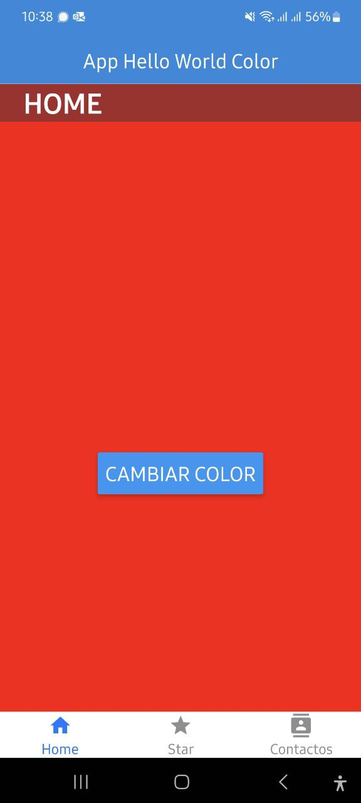
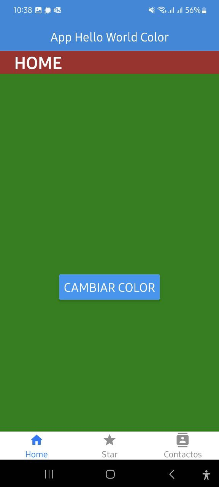
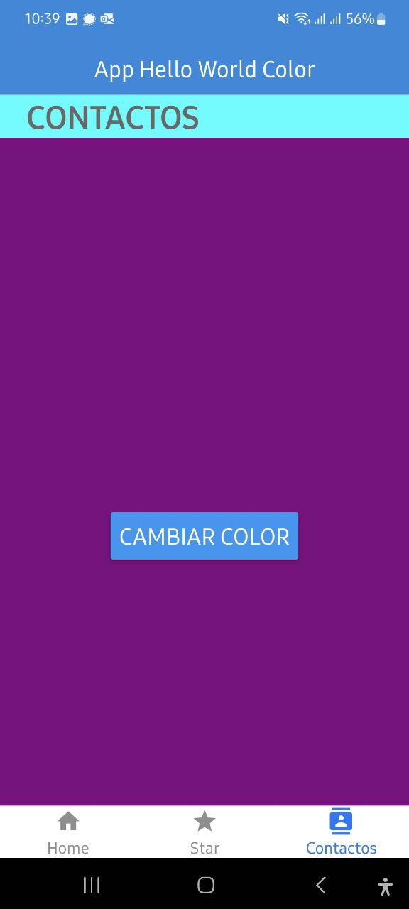
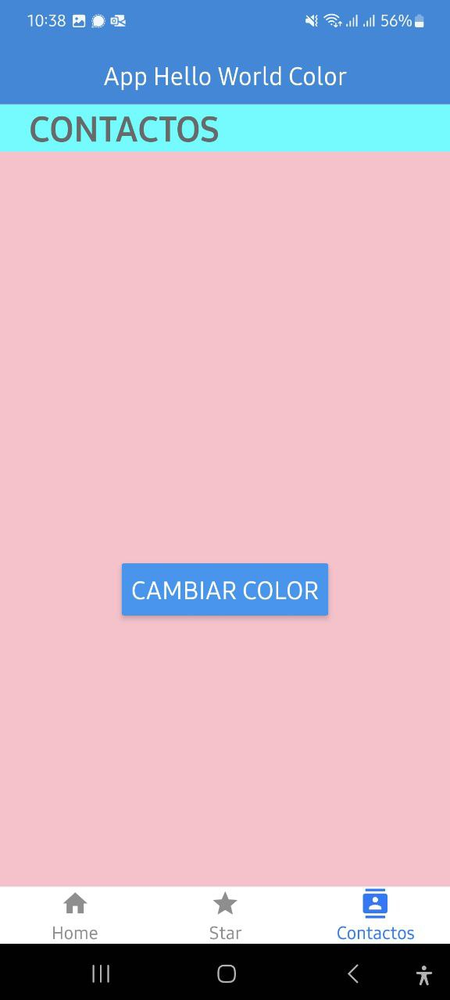
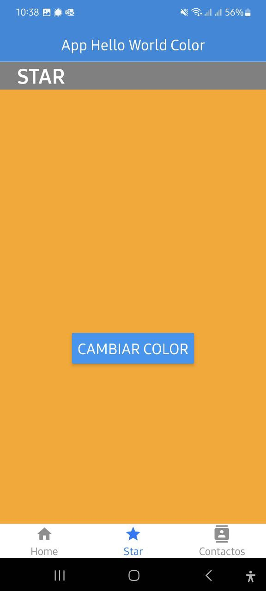

# Actividad_PGL_App_Expo

Actividad para PGL de aplicación 'Hello World' con Expo

# Mi Proyecto Expo

Este es un proyecto de Expo que muestra tres paginas a las que se acceden desde la barra de navegacion inferio y en cada una hay un boton para cambiar el color de fondo.

## Descripción

Este proyecto tiene las siguientes características:

- Muestra un encabezado con el título de la aplicación y un encabezado de la página en la que se encuentra.
- Cambia el color de fondo al presionar un botón.
- Incluye una barra de navegación inferior con tres opciones para acceder a las páginas.

## Capturas de Pantalla

Captura 1

---

  
Captura 2

---

  
Captura 3

---

  
Captura 4

---

  
Captura 5

---
